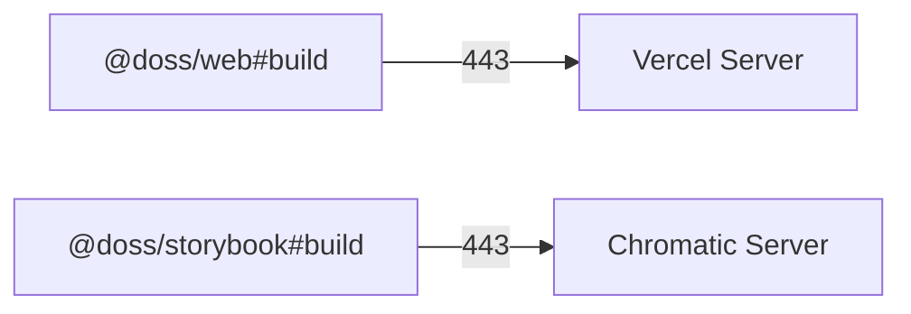

# CI

## Deployment target servers

```mermaid
graph LR
  A["@doss/web#build"] --"443"--> B["Vercel Server"]
  C["@doss/storybook#build"] --"443"--> D["Chromatic Server"]
```

## TODO

- [ ] Manage all CI tasks through turbo.
