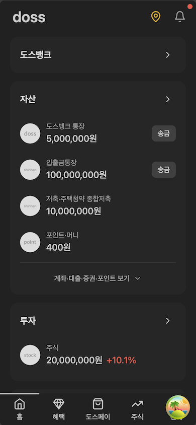
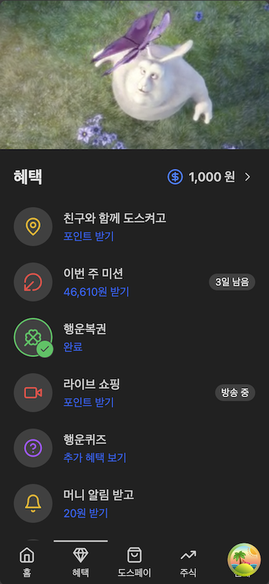
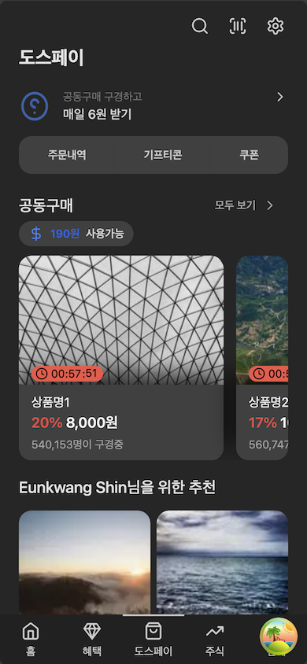
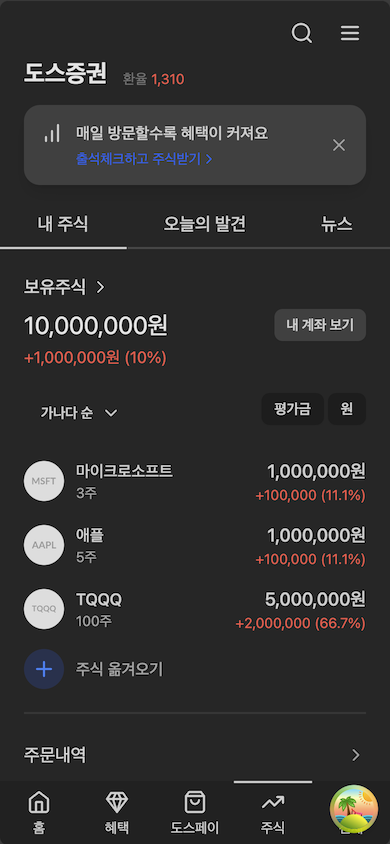

# Doss


Duplicated version of the Toss application

- Web: [doss.gracefullight.dev](https://doss.gracefullight.dev)
- API Docs: [doss.gracefullight.dev/docs](https://doss.gracefullight.dev/docs)
- UI Docs: [main--650ba8a17a4e0b2274273663.chromatic.com](https://main--650ba8a17a4e0b2274273663.chromatic.com)

| Example                               | Image                                 |
| ------------------------------------- | ------------------------------------- |
|  |  |
|  |  |

## Structure

This section outlines the directory structure of the project, providing a high-level overview of how the codebase is organized.

```bash
.
├── apps
│   ├── storybook: doss UI storybook
│   └── web: doss web application
└── packages
    ├── config
    │   ├── eslint: Shared ESLint configurations
    │   ├── tailwind: Shared Tailwind CSS configurations
    │   └── ts: Shared TypeScript configurations
    ├── db: Shared database schema, using Prisma
    └── ui: Shared ui components, using Tailwind and Daisy
```

## Stacks

This section lists the key technologies and libraries used in the project.

- [nextjs](https://github.com/vercel/next.js)
- [turbo](https://github.com/vercel/turbo)
- [prisma](https://github.com/prisma/prisma)
- [trpc](https://github.com/trpc/trpc)
- [redoc](https://github.com/Redocly/redoc)
- [tailwind](https://github.com/tailwindlabs/tailwindcss)
- [lucide](https://github.com/lucide-icons/lucide)
- [daisyui](https://github.com/saadeghi/daisyui)
- [storybook](https://github.com/storybookjs/storybook)
- [vitest](https://github.com/vitest-dev/vitest)
- [playwright](https://github.com/microsoft/playwright)

## Getting Started

This section will guide you through setting up the development environment.

### Server Setup

To initialize the server environment, execute the following commands in your terminal:

```bash
pnpm install
pnpm dev

```

### Database Configuration

To configure the database, please follow these steps:

1. **Download Podman Desktop**: Visit the Podman Desktop website and download the appropriate version for your system.
2. **Initialize Pod**: Open Podman Desktop and run a new pod.
3. **Database Migration**: Execute the commands below to run the database container and perform the initial migration.

```bash
podman run -d \
  -e POSTGRES_PASSWORD=default \
  -e POSTGRES_USER=default \
  -e POSTGRES_DB=verceldb \
  -p 5432:5432 \
  --name doss-pg postgres
```

```bash
pnpm migrate:dev
```

For more information on the database structure, you can consult the Entity Relationship Diagram ([ERD](./packages/db/README.md)).

## How to Contribute

I greatly appreciate your interest in contributing to our project! To get involved, kindly refer to our list of remaining tasks available on the [project board](https://github.com/users/gracefullight/projects/2).

### Steps to Contribute

1. **Request Permission**: Please reach out to the project maintainer to request permission for contributing.
2. **Collaboration**: Upon receiving permission, you are welcome to contribute by coding, bug-fixing, or tackling other tasks listed on the project board.
