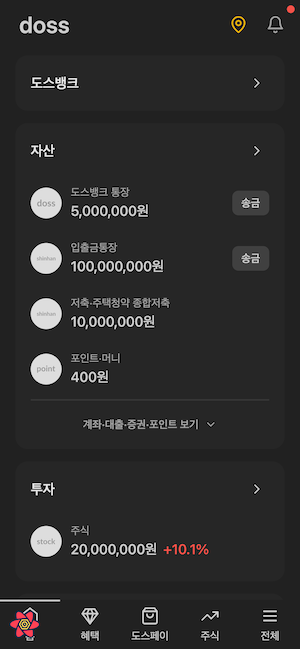
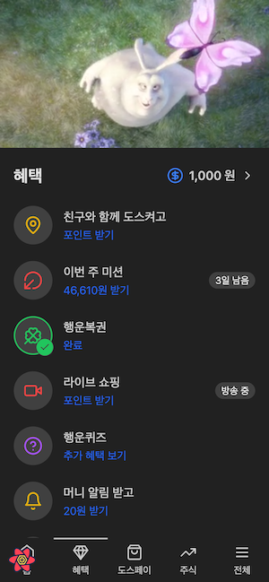
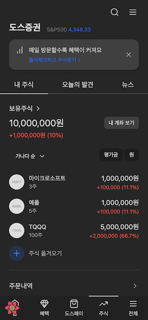

# Doss


Toss 앱의 웹 클론 버전

- Web: [doss.gracefullight.dev](https://doss.gracefullight.dev)
- API Docs: [doss.gracefullight.dev/docs](https://doss.gracefullight.dev/docs)
- UI Docs: [main--650ba8a17a4e0b2274273663.chromatic.com](https://main--650ba8a17a4e0b2274273663.chromatic.com)

| 예시                                  | 이미지                                |
| ------------------------------------- | ------------------------------------- |
|  |  |
|  |  |

## 구조

이 섹션은 프로젝트의 디렉토리 구조를 개요로 설명하며, 코드베이스가 어떻게 구성되어 있는지 고수준에서 살펴봅니다.

```bash
.
├── apps
│   ├── storybook: doss UI 스토리북
│   └── web: doss 웹 어플리케이션
└── packages
    ├── config
    │   ├── eslint: 공유 ESLint 설정
    │   ├── tailwind: 공유 Tailwind CSS 설정
    │   └── ts: 공유 TypeScript 설정
    ├── db: 공유 데이터베이스 스키마, Prisma 사용
    └── ui: 공유 UI 컴포넌트, Tailwind와 Daisy 사용
```

## 기술 스택

이 섹션에서는 프로젝트에서 사용되는 주요 기술과 라이브러리를 나열합니다.

- [nextjs](https://github.com/vercel/next.js)
- [turbo](https://github.com/vercel/turbo)
- [prisma](https://github.com/prisma/prisma)
- [trpc](https://github.com/trpc/trpc)
- [redoc](https://github.com/Redocly/redoc)
- [tailwind](https://github.com/tailwindlabs/tailwindcss)
- [lucide](https://github.com/lucide-icons/lucide)
- [daisyui](https://github.com/saadeghi/daisyui)
- [storybook](https://github.com/storybookjs/storybook)
- [vitest](https://github.com/vitest-dev/vitest)
- [playwright](https://github.com/microsoft/playwright)

## 시작하기

이 섹션에서는 개발 환경을 설정하는 방법을 안내합니다.

### 서버 설정

서버 환경을 초기화하려면 터미널에서 다음 명령을 실행하세요.

```bash
pnpm install
pnpm dev

```

### 데이터베이스 설정

데이터베이스를 설정하려면 다음 단계를 따르세요.

1. **Podman 다운로드**: Podman Desktop 웹사이트를 방문해 시스템에 적합한 버전을 다운로드합니다.
2. **Pod 초기화**: Podman Desktop을 열고 새로운 Pod를 실행합니다.
3. **데이터베이스 마이그레이션**: 아래 명령어를 실행해 데이터베이스 컨테이너를 실행하고 초기 마이그레이션을 수행합니다.

```bash
podman run -d \
  -e POSTGRES_PASSWORD=default \
  -e POSTGRES_USER=default \
  -e POSTGRES_DB=verceldb \
  -p 5432:5432 \
  --name doss-pg postgres
```

```bash
pnpm migrate:dev
```

데이터베이스 구조에 대한 자세한 정보는 엔터티 관계 다이어그램 ([ERD](./packages/db/README.md))을 참조할 수 있습니다.

## 기여하는 방법

프로젝트에 기여에 관심을 가져 주셔서 감사합니다! 참여하려면 [프로젝트 보드](https://github.com/users/gracefullight/projects/2)에서 남아 있는 작업 목록을 참고해 주세요.

### 기여 단계

1. **권한 요청**: 저에게 기여에 대한 권한을 요청해 주세요.
2. **협업**: 권한을 받은 후, 코드 작성, 버그 수정, 또는 프로젝트 보드에 나열된 다른 작업을 수행하여 기여할 수 있습니다.
