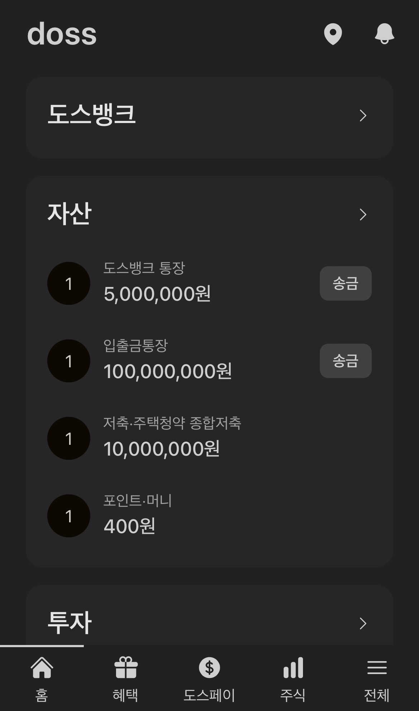

# Doss

Duplicated version of Toss application



## structure

```bash
.
├── apps
│   └── web: Next.js application
└── packages
    ├── config
    │   ├── eslint: Shared ESLint configurations
    │   ├── tailwind: Shared Tailwind CSS configurations
    │   └── ts: Shared typescript configurations
    └── db: Shared database schema, using Prisma
```

## server

```bash
pnpm install
pnpm dev
```

## db

1. Download [Rancher desktop](https://rancherdesktop.io/)
2. Run Pod
3. Migrate

```bash
docker run -d \
  -e POSTGRES_PASSWORD=default \
  -e POSTGRES_USER=default \
  -e POSTGRES_DB=verceldb \
  -p 5432:5432 \
  --name doss-pg postgres
```

```bash
pnpm migrate:dev
```

## TODO

- [x] [t3-oss/create-t3-turbo](https://github.com/t3-oss/create-t3-turbo)
  - [prisma/deployment-guides](https://www.prisma.io/docs/guides/deployment/deployment-guides/deploying-to-vercel)
- [trpc/examples-next-app-dir](https://github.com/trpc/examples-next-app-dir)
