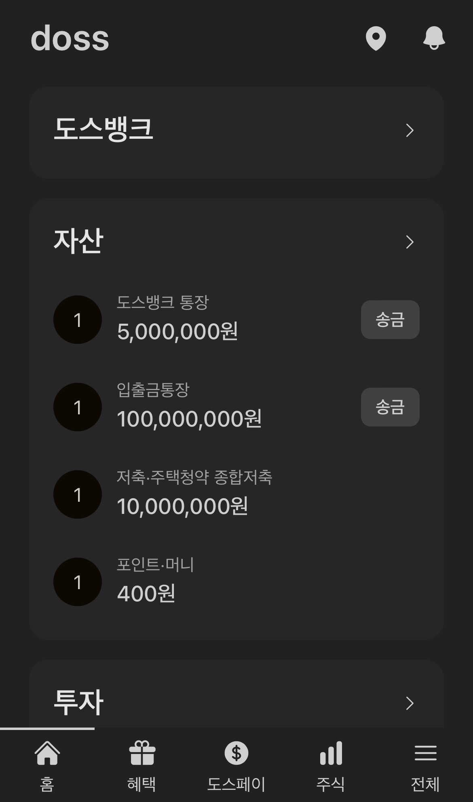

# Doss

Duplicated version of Toss application



## server

```bash
pnpm install
pnpm dev
```

## db

1. Download [Rancher desktop](https://rancherdesktop.io/)
2. Run

```bash
docker run -d \
  -e POSTGRES_PASSWORD=default \
  -e POSTGRES_USER=default \
  -e POSTGRES_DB=verceldb \
  -p 5432:5432 \
  --name doss-pg postgres
```
