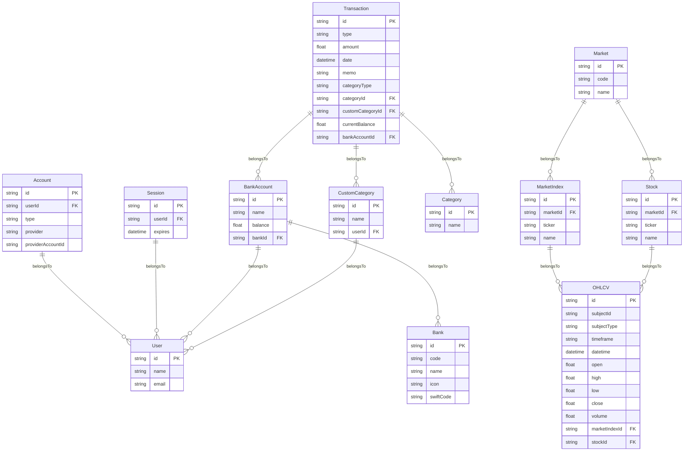

## ERD


```mermaid
erDiagram
    Account ||--o{ User : belongsTo
    Session ||--o{ User : belongsTo
    BankAccount ||--o{ User : belongsTo
    Transaction ||--o{ BankAccount : belongsTo
    CustomCategory ||--o{ User : belongsTo
    Transaction ||--o{ CustomCategory : belongsTo
    Transaction ||--o{ Category : belongsTo
    BankAccount ||--o{ Bank : belongsTo
    Market ||--o{ MarketIndex : belongsTo
    Market ||--o{ Stock : belongsTo
    MarketIndex ||--o{ OHLCV : belongsTo
    Stock ||--o{ OHLCV : belongsTo

    Account {
        string id PK
        string userId FK
        string type
        string provider
        string providerAccountId
    }
    Session {
        string id PK
        string userId FK
        datetime expires
    }
    User {
        string id PK
        string name
        string email
    }
    Bank {
        string id PK
        string code
        string name
        string icon
        string swiftCode
    }
    BankAccount {
        string id PK
        string name
        float balance
        string bankId FK
    }
    Transaction {
        string id PK
        string type
        float amount
        datetime date
        string memo
        string categoryType
        string categoryId FK
        string customCategoryId FK
        float currentBalance
        string bankAccountId FK
    }
    Category {
        string id PK
        string name
    }
    CustomCategory {
        string id PK
        string name
        string userId FK
    }
    Market {
        string id PK
        string code
        string name
    }
    MarketIndex {
        string id PK
        string marketId FK
        string ticker
        string name
    }
    Stock {
        string id PK
        string marketId FK
        string ticker
        string name
    }
    OHLCV {
        string id PK
        string subjectId
        string subjectType
        string timeframe
        datetime datetime
        float open
        float high
        float low
        float close
        float volume
        string marketIndexId FK
        string stockId FK
    }

```

## Reset

```bash
pnpm --filter "@doss/db" with-env prisma migrate reset
```

```bash
ps -ef | grep prisma | awk '{print $2}' | xargs kill -9
```
